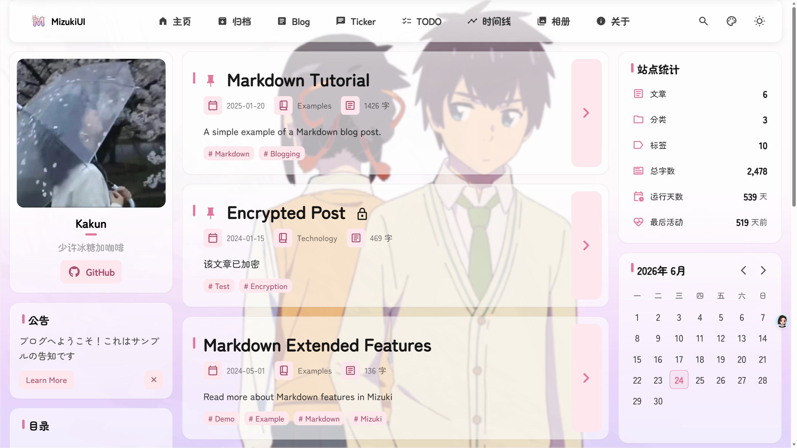
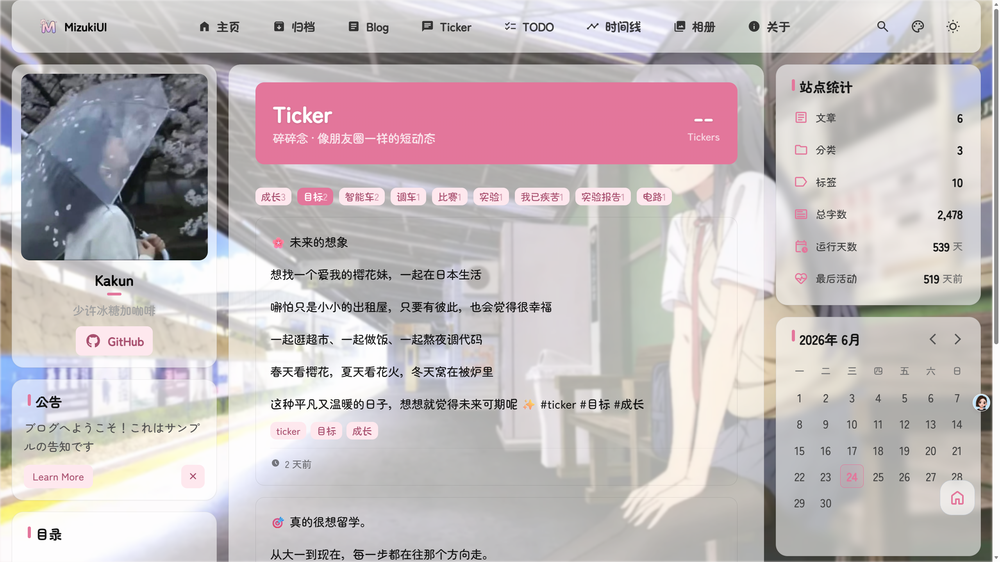
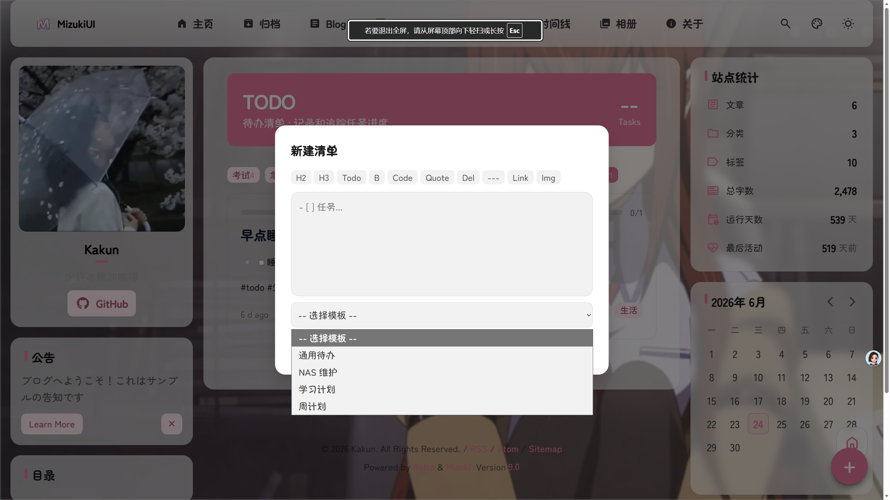
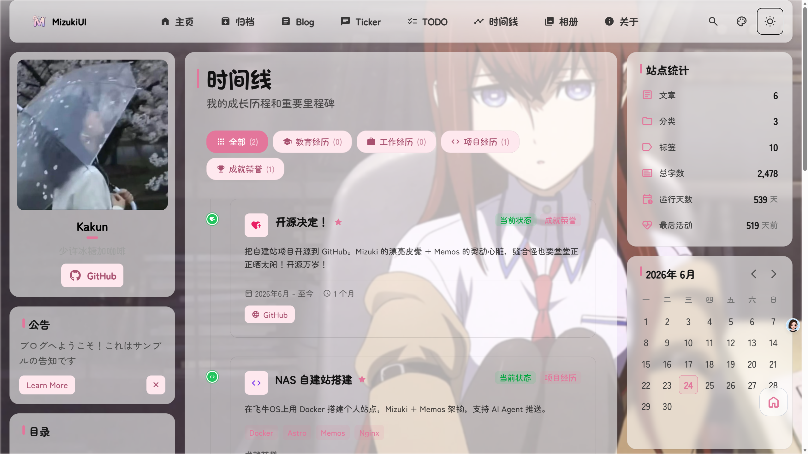
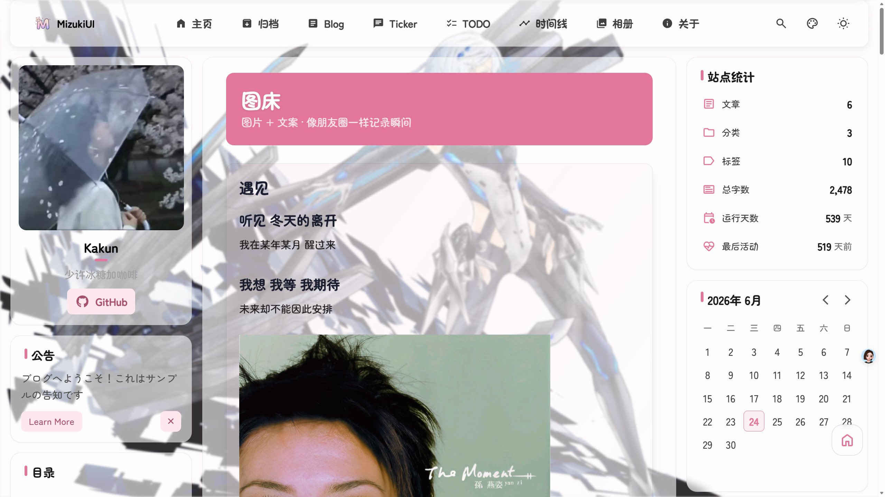
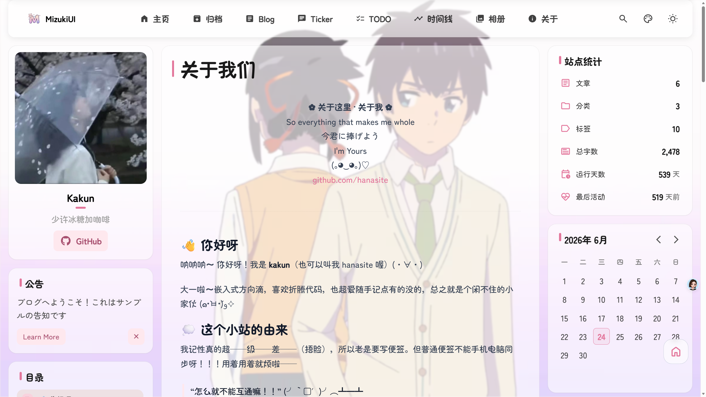

# 🌟 StarryNight — Mizuki × Memos 二次元自建站

[English](README.md) | 中文

> 如果你也是那种  
> 喜欢分享情绪和感受、随手记下某个瞬间的小孩；  
> 如果你也想在抬头就能望见天花板的空间里，  
> 造一座属于自己的小窝——  
> 那些美好的、快乐的、不好的、悲伤的，  
> 就把它们当作一颗颗星星，挂在这里吧……  

> So everything that makes me whole  
> 今君に捧げよう  
> I'm Yours

**StarryNight** 是一个二次元风格的自建个人站点，融合**静态美观页面 + 动态记事功能**，基于 [Mizuki](https://github.com/LyraVoid/Mizuki)（Astro MD3 主题）和 [Memos](https://github.com/usememos/memos)（Go 轻量后端）搭建，还配套 AI 助手联动能力。

**项目寓意：** 把生活里快乐、难过、细碎的所有瞬间都化作星星，存放在自己搭建的专属小窝里 ✨

## 📸 预览

<p align="center">
  
  
  <br>
  
  
  <br>
  
  
</p>

## 🏗 技术架构

```
浏览器 → Nginx :3000 → Mizuki 静态页面
                       → /api/* → Memos :5230（REST API）
                       → /mcp  → Memos :5230（AI Agent MCP 接口）

AI Agent → REST API /api/v1/memos  (curl/脚本调用)
         → MCP Protocol /mcp       (AI 原生接口)
```

**核心组件：**

| 组件 | 角色 | 技术 |
|------|------|------|
| **Mizuki** | 前端静态主题 | Astro、MD3 设计、二次元风格 |
| **Memos** | 后端数据服务 | Go、REST API、MCP、SQLite |
| **Nginx** | 反向代理 & 静态资源分发 | 统一路由、注入认证头 |
| **daily-banner.sh** | 定时任务 | 每日随机轮播横幅图 |

## 📄 页面 & 内容来源

通过给 Memos 内容打上不同标签，自动归类到对应页面，无需手动分栏：

| 路径 | 功能 | 标签 |
|------|------|------|
| `/` | 首页 · 横幅轮播 | 静态 + 每日随机图 |
| `/ticker/` | 碎碎念 | `#ticker` |
| `/blog/` | 博文 | `#blog` |
| `/todo/` | 待办清单 | `#todo` |
| `/gallery/` | 图库 | `#gallery` |
| `/timeline/` | 时间历程 | 静态 + `#milestone` |
| `/guestbook/` | 留言板 | Memos `#guestbook` |
| `/about/` | 关于我 | 静态 |

## ✨ 核心特色

- **二次元 MD3 视觉风格** — Material Design 3 × 动漫美学
- **Markdown 编辑器** — 标题、粗体、代码、分割线等一键插入
- **轻量化自建部署** — NAS、VPS、任何 Linux 服务器均可运行
- **每日随机横幅图** — 可选《命运石之门》风格数码管时钟小组件
- **双认证体系** — 浏览器 Cookie 登录 / Token 接口调用
- **AI Agent 联动** — 通过 MCP 协议让 AI 自动读写 Memos
- **标准 REST API** — 支持 curl、脚本等远程操作

## 🚀 快速开始

### 环境要求
- Node.js 18+ / pnpm
- Docker & Docker Compose
- 一台 NAS 或 Linux 服务器

### 本地开发调试

```bash
# 1. 启动 Memos 后端
docker run -d --name memos -p 5230:5230 \
  -v ~/.memos:/var/opt/memos \
  neosmemo/memos:stable

# 2. 构建并启动前端
cd Mizuki
pnpm install
pnpm run build
pnpm run preview
```

### NAS 线上部署

完整部署指南见 [DEPLOY_TO_NAS.md](DEPLOY_TO_NAS.md)

```bash
# docker-compose 一键启动
docker compose up -d
```

### AI Agent 推送

AI 接入文档见 [AI_AGENT_PUSH_GUIDE.md](AI_AGENT_PUSH_GUIDE.md)

```bash
# 通过 API 发布一条碎碎念
echo "今晚的星星真美 #ticker" | curl -X POST \
  -H "Content-Type: application/json" \
  -H "Authorization: Bearer YOUR_TOKEN" \
  -d @- http://localhost:5230/api/v1/memos
```

## 🎯 适用人群

适合这样的你：
- 喜欢记录日常、随笔、图文、待办
- 想要完全私有化自建二次元个人博客
- 不想使用第三方平台
- 有 NAS/服务器，喜欢折腾自建站点

## 📦 技术栈

| 层级 | 技术 |
|------|------|
| 前端 | Astro、Mizuki 主题、MD3 |
| 后端 | Go、Memos、SQLite |
| 反向代理 | Nginx (Alpine) |
| 运行环境 | Docker、Docker Compose |
| 自动化 | Bash、MCP 协议 |

## 📜 开源协议

MIT

---

*用 ❤️ 制作 by [Kakun](https://github.com/hanasite)*
